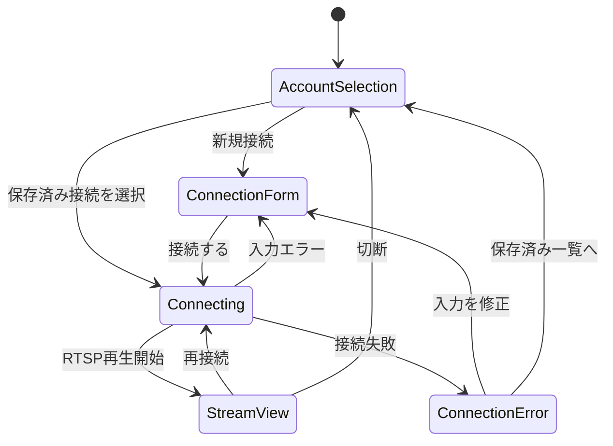

# ログインからRTSPストリーミング開始までの設計

ステータス: Draft

## 1. 目的とスコープ

IPアドレス、カメラアカウントのユーザー名・パスワードを入力すると、TapoカメラのRTSP映像を表示するデスクトップクライアントを作る。

今回の初期スコープは次のとおり。

- 複数のカメラ接続先を保存し、次回起動時に選択できる。
- 新規接続では、IPアドレス、ユーザー名、パスワードを入力する。
- 保存済み接続を選択すると、保存した接続先情報と資格情報を使って接続する。
- RTSPの高画質ストリーム（`stream1`）と低画質ストリーム（`stream2`）を選択できる。
- 接続中、再生中、切断、接続失敗を画面上で明確に表現する。

初期スコープには含めないもの。

- Tapoクラウドへのログイン、カメラの初期設定
- PTZ、録画、音声通話、動体検知などのカメラ操作
- カメラの自動検出、WAN越しの接続、ルーター設定

## 2. 前提と判断

### 2.1 UI

画面遷移が必要なデスクトップアプリを想定し、UI層はJavaFXを第一候補とする。ただし、アプリケーション層・ドメイン層はJavaFXに依存させない。UIフレームワークの最終決定とMaven依存関係の追加は、画面の最小プロトタイプで確認してから行う。

### 2.2 RTSP

TP-Linkの公式ガイドでは、TapoのRTSP接続先として次の形式が案内されている。

```text
rtsp://<IPアドレス>:554/stream1  # 高画質
rtsp://<IPアドレス>:554/stream2  # 低画質
```

RTSPに使うユーザー名・パスワードは、Tapoアプリで作成する「カメラのアカウント」であり、TP-Link ID/Tapoアプリのログイン情報とは別物として扱う。C210については公式FAQの対象製品一覧に含まれているが、実際の接続可否や挙動はハードウェアバージョン・ファームウェア・設定に依存し得るため、初期実装の完了条件にC210実機での接続確認を含める。RTSP対応、ポート、パス、ファームウェア差異をコードに直書きせず、接続設定とアダプターで吸収する。

アプリケーション層では、資格情報をRTSP URIに埋め込まず、次のように接続要求を分離する。

```text
RtspConnectionRequest
  endpoint: RtspEndpoint(host, port, streamPath)
  credentials: CameraCredentials(username, password)
```

再生ライブラリがURI形式を要求する場合だけ、最も外側のアダプターで一時的にURIを組み立てる。ログ、例外、画面表示にはパスワードを出さない。

### 2.3 保存済みアカウント

「前回入力したアカウントを選択する」ため、メタデータと秘密情報を分けて保存する。

- メタデータ: プロファイルID、表示名、IPアドレス、ポート、ユーザー名、画質、最終利用日時
- 秘密情報: プロファイルIDに紐づくパスワード
- パスワード保存先: OSの資格情報ストアを使う `SecretStore` ポート
- OSの資格情報ストアが使えない場合: パスワードを平文保存せず、次回接続時に再入力を求める
- 保存は「この接続を記憶する」の明示的な選択時だけ行う
- プロファイル削除時はメタデータと秘密情報を同時に削除する

メタデータファイルにパスワードを入れない。保存されたプロファイルの一覧には、パスワードを表示せず、必要な場合だけSecretStoreから再取得する。

## 3. 画面遷移



### 3.1 接続先選択画面

起動時の画面。保存済みプロファイルを一覧表示し、「新しい接続」と「削除」を提供する。

表示項目:

- 表示名（未設定の場合は `ユーザー名@IPアドレス` を仮表示）
- IPアドレス
- ユーザー名
- 使用するストリーム（高画質／低画質）
- 最終利用日時

保存済みプロファイルを選択して接続する場合、保存済みパスワードが取得できなければ接続フォームへ遷移して再入力を求める。パスワードを画面に復元表示しない。

### 3.2 接続フォーム画面

入力項目:

- IPアドレス: 初期実装はIPv4を必須とする。将来IPv6を追加できるモデルにする
- ポート: 初期値 `554`、変更可能
- ユーザー名
- パスワード
- ストリーム: 高画質（`stream1`）／低画質（`stream2`）
- 「この接続を記憶する」チェックボックス（初期値オフ）

「接続する」を押す前に、IPアドレス、ポート、ユーザー名、パスワードの空欄と形式をローカル検証する。入力エラーではネットワークへ接続しない。

### 3.3 接続中画面

接続処理中は二重接続を防止し、進捗表示とキャンセル操作を提供する。処理には接続タイムアウトを設定し、無期限に画面をブロックしない。

### 3.4 ストリーム画面

RTSP再生領域、接続先の表示、現在のストリーム品質、切断、再接続を提供する。パスワードやRTSP URI全体は表示しない。

### 3.5 エラー表示

利用者向けメッセージと、ログに残す診断用コードを分ける。

| 内部分類 | 画面メッセージ例 | 次の操作 |
| --- | --- | --- |
| 入力不正 | IPアドレスまたはポートを確認してください | 入力フォームへ戻る |
| 到達不能／タイムアウト | カメラに接続できません | 入力修正、再試行 |
| 認証失敗 | カメラアカウントを確認してください | パスワード再入力 |
| RTSP非対応／パス不正 | RTSPストリームを開始できません | stream1/stream2変更、設定確認 |
| デコード失敗 | 映像を再生できません | 再接続、対応形式の調査 |

認証失敗でも、画面やログに入力されたパスワードを出さない。

## 4. レイヤー構成

```text
JavaFX UI
  └─ Application services / use cases
       ├─ CameraProfileRepository
       ├─ SecretStore
       ├─ RtspSessionFactory
       └─ StreamPlayer
            └─ RTSP再生ライブラリのadapter
```

### 4.1 Presentation層

JavaFXの画面、画面状態、入力値の変換を担当する。RTSP URIの組み立て、ファイル保存、再生ライブラリの呼び出しは行わない。

### 4.2 Application層

次のユースケースを持つ。

- `ListSavedProfiles`: 保存済みプロファイルの一覧取得
- `ConnectWithProfile`: プロファイルを選択し、SecretStoreから資格情報を取得して接続
- `ConnectWithCredentials`: フォーム入力を検証し、接続して必要なら保存
- `DisconnectCamera`: セッション停止と再生停止
- `ReconnectCamera`: 同じ設定で再接続

接続処理はUIスレッドをブロックせず、キャンセル可能な非同期処理とする。UIは状態を `Idle`、`Connecting`、`Playing`、`Failed`、`Disconnecting` として表示する。

### 4.3 Domain層

候補モデル:

```text
CameraProfile
  profileId
  displayName
  host
  port
  username
  streamQuality
  lastUsedAt

CameraCredentials
  username
  password

RtspEndpoint
  host
  port
  streamPath

StreamQuality
  HIGH -> /stream1
  LOW  -> /stream2
```

`CameraProfile` はパスワードを持たない。`CameraCredentials` はメモリ上でのみ扱い、接続終了後に保持し続けない設計にする。

### 4.4 PortとAdapter

```text
CameraProfileRepository
  save(profile)
  list()
  delete(profileId)

SecretStore
  save(profileId, password)
  load(profileId)
  delete(profileId)

RtspSessionFactory
  open(request, cancellationToken)

RtspSession
  start()
  stop()

StreamPlayer
  attach(session, videoSurface)
  play()
  stop()
```

再生エンジンはPortの外側に置く。候補はVLCJまたはFFmpeg系だが、ネイティブランタイムの配布、ライセンス、JavaFXの映像領域への埋め込みやすさを小さな実機／ローカル検証で比較してから決める。

## 5. データ保存

メタデータの保存形式は初期実装ではJSONを候補とする。保存場所はOSごとのアプリケーションデータディレクトリを使い、作業ディレクトリやリポジトリ直下には作らない。

保存例（パスワードは含めない）:

```json
{
  "profiles": [
    {
      "id": "generated-profile-id",
      "displayName": "リビング",
      "host": "192.168.1.20",
      "port": 554,
      "username": "camera-user",
      "streamQuality": "HIGH",
      "lastUsedAt": "2026-08-24T12:00:00Z"
    }
  ]
}
```

ファイル更新は一時ファイルへの書き込み後に置換し、プロセス停止中に既存データを壊しにくくする。保存形式には将来の移行に備えてバージョンを持たせる。

## 6. TDDでの実装順序

1. `StreamQuality` と `RtspEndpoint` のテストを先に作り、`stream1`／`stream2` の変換とポート既定値を確定する。
2. IPアドレス、ポート、ユーザー名、パスワードの入力バリデーターを実装する。
3. `CameraProfileRepository` と `SecretStore` のPort、およびファイル／資格情報ストアのテストダブルを作る。
4. `ConnectWithCredentials` と `ConnectWithProfile` のユースケースを、偽のセッションでテストする。
5. 接続選択画面と接続フォーム画面を作り、画面状態のテストを追加する。
6. 再生エンジンの候補を比較する最小のRTSP POCを作り、C210実機で `stream1`／`stream2` を確認する。
7. 採用した再生エンジンをAdapterとして組み込み、接続タイムアウト、認証失敗、切断、再接続をテストする。

標準CIではカメラ実機を要求しない。実機確認は、接続先と資格情報を外部設定から与える明示的な統合テストとして分離する。

## 7. 受け入れシナリオ

- 保存済みプロファイルがない状態で起動すると、接続フォームへ進める。
- 正しいIPアドレス、ユーザー名、パスワードで接続すると、RTSP映像画面へ遷移する。
- 「記憶する」を選んだ接続は、次回起動時に一覧から選択できる。
- 保存済み接続を選択すると、パスワードを再表示せずに接続できる。
- 保存済みパスワードが取得できない場合は、再入力を求める。
- 誤った認証情報では、秘密情報を漏らさずに認証エラーを表示できる。
- 接続タイムアウト時にUIが固まらず、再試行または入力修正へ進める。
- stream1で失敗した場合、stream2を選択して再試行できる。
- プロファイル削除後、メタデータと保存済みパスワードの両方が削除される。

## 8. 未決定事項

- 対応OSをWindows限定にするか、macOS/Linuxも対象にするか
- JavaFXを正式採用するか
- RTSP再生エンジン（VLCJ、FFmpeg系など）
- OS資格情報ストアの実装方式と、対応できないOSでの挙動
- C210のハードウェアバージョン、ファームウェア、RTSP用カメラアカウントの準備状況
- 初期ストリームを高画質にするか低画質にするか
- 接続先プロファイルの表示名をユーザー入力にするか自動生成だけにするか

## 9. 参考資料

- [Tapoを使用したRTSPライブストリーミングの利用方法（TP-Link日本）](https://www.tp-link.com/jp/support/faq/2680/)
- [TapoカメラとRTSP/ONVIFに関するよくある質問（TP-Link日本）](https://www.tp-link.com/jp/support/faq/4465/)
- [How to View Tapo Camera on PC, NAS, or NVR Using RTSP/ONVIF（Tapo公式）](https://www.tapo.com/en/faq/34/)
