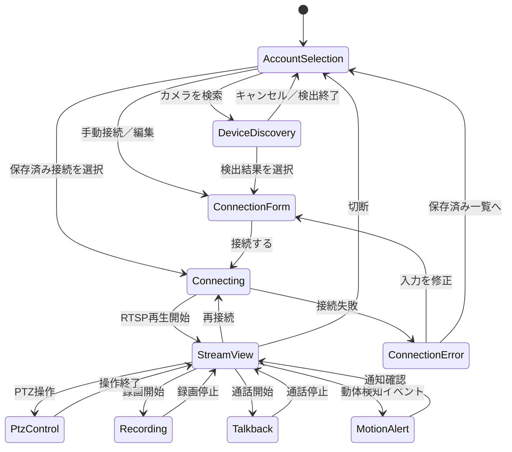

# C210クライアントの画面・通信設計

ステータス: Draft

## 1. 目的と初期スコープ

Tapo C210を同一LAN上から操作するJavaFXデスクトップクライアントを作る。起動後に保存済みカメラを選択するか、カメラを自動検出して接続先を選び、カメラアカウントのユーザー名・パスワードで接続する。

初期スコープは次のとおり。

- ONVIF WS-Discoveryによる同一LAN上のカメラ自動検出
- IPアドレス、ユーザー名、パスワードによる手動接続
- 接続先プロファイルの保存と、次回起動時の選択
- プロファイル表示名の自動生成（ユーザー入力は受け付けない）
- JavaFXによるライブ映像表示
- RTSP高画質ストリーム（`stream1`）の初期再生
- RTSP低画質ストリーム（`stream2`）への切り替え
- パン・チルト（PTZ）操作
- ライブ映像のローカル録画の開始・停止
- 動体検知イベントの受信と画面通知
- 双方向音声通話のためのUIと通信Port
- 接続中、再生中、録画中、切断、接続失敗を画面上で明確に表現する

録画はまず「現在のライブ映像をクライアントPCへ保存するローカル録画」を確実な対象とする。カメラ内microSDの録画一覧・再生・削除は、C210が第三者プロトコル経由で公開する機能を確認したうえで、同じ初期スコープの任意機能として実装する。

## 2. 前提と重要な判断

### 2.1 UIとライブラリ

UIはJavaFXを正式採用する。JavaFXの画面・コントローラーはPresentation層に閉じ込め、通信・録画・カメラ制御のコードからJavaFX型を参照しない。

RTSPのパケット処理やデコードは自前実装せず、RTSP対応ライブラリを使用する。最初のPOCではVLCJ/libVLCを採用し、ネイティブランタイムの配布やJavaFX映像領域への埋め込みに問題があれば、FFmpeg系ライブラリへ差し替えられるよう `StreamPlayer` と `RecordingEngine` のAdapterで隔離する。Maven依存関係とネイティブランタイムの配布方法は、POCで確認してから確定する。

VLCJ 4.8.3はGPLv3であり、実行時にLibVLCのnativeライブラリを必要とする。したがって、VLCJ依存は`RtspConnector`のAdapter内に閉じ込め、CIではnative LibVLCを起動しない。配布時のVLC／VLCJライセンス方針は別途確定する。

### 2.2 C210のプロトコル分担

通信方式を機能ごとに分ける。

| 機能 | 第一候補 | 初期方針 |
| --- | --- | --- |
| カメラ検出 | ONVIF WS-Discovery | 同一LANのマルチキャストで検出する |
| ライブ映像 | RTSP | `stream1` を初期値、`stream2`へ切り替え可能 |
| PTZ | ONVIF Profile S | ONVIFのPTZ能力を確認して操作する |
| 動体検知 | ONVIFイベント | 対応するイベントを購読し、未対応なら機能を無効表示する |
| ローカル録画 | RTSP再生ライブラリまたは録画ライブラリ | ライブ映像をPCへ保存する |
| 双方向音声 | ONVIF以外のC210固有・追加プロトコル | `TalkbackPort` を先に定義し、実機検証後にAdapterを選ぶ |
| microSD録画の操作 | ONVIF追加ProfileまたはC210固有プロトコル | 能力検出できた場合だけ有効化する |

TP-Link公式FAQでは、TapoはONVIF Profile S、ONVIFポート2020、RTSPポート554を使用し、Profile Sは映像・音声ストリーミング、イベント処理、PTZなどの基本機能を扱うと説明されている。一方、第三者プラットフォームからの双方向通話はProfile Sに含まれないため、RTSP/ONVIFだけで実現できる前提にはしない。

### 2.3 RTSP接続

公式に案内されているRTSP接続先は次の形式とする。

```text
rtsp://<IPアドレス>:554/stream1  # 高画質
rtsp://<IPアドレス>:554/stream2  # 低画質
```

初期値は高画質の `stream1` とする。RTSPに使うユーザー名・パスワードは、Tapoアプリで作成するカメラアカウントであり、TP-Link ID/Tapoアプリのログイン情報とは別物として扱う。

アプリケーション層では、資格情報をRTSP URIに埋め込まず、接続要求を分離する。

```text
RtspConnectionRequest
  endpoint: RtspEndpoint(host, port, streamPath)
  credentials: CameraCredentials(username, password)
```

再生ライブラリがURI形式を要求する場合だけ、最も外側のAdapterで一時的にURIを組み立てる。ログ、例外、画面表示にはパスワードを出さない。

### 2.4 自動検出

ONVIF WS-DiscoveryのProbeを同一LANへ送信し、ProbeMatchの応答からカメラ候補を作る。ONVIF Profile Sの標準的な検出経路を使い、対象ネットワークはローカルサブネットに限定する。

- 検出はユーザーが「カメラを検索」を押したときに明示的に開始する。
- マルチキャスト送信先は `239.255.255.250:3702` とする。
- 検出タイムアウトを設定し、応答がない場合も画面を固めない。
- VLAN、AP分離、Windowsファイアウォールなどで検出できない場合は、IP手入力へ切り替えられるようにする。
- 検出結果にはIPアドレス、ONVIFサービスURL、メーカー、モデル、ハードウェア情報を表示する。
- 検出だけでは資格情報を確定しない。候補選択後にカメラアカウントを入力して接続する。

### 2.5 保存済みプロファイルと表示名

前回入力したアカウントを選択できるよう、SQLiteデータベースへプロファイルとパスワードを保存する。同一LAN内の個人利用を前提とし、パスワードはSQLiteへ平文保存する。

- メタデータ: プロファイルID、表示名、IPアドレス、ポート、ユーザー名、画質、最終利用日時、検出したモデル
- 秘密情報: プロファイルIDに紐づくパスワード
- 保存先: OSごとのアプリケーションデータディレクトリに置くSQLiteファイル
- 保存方式: `camera_secrets.password` に平文で保存する。OS資格情報ストア、マスターパスワード、追加の暗号鍵は使わない
- 保存は「この接続を記憶する」の明示的な選択時だけ行う
- プロファイル削除時はSQLiteのトランザクションでメタデータと秘密情報を同時に削除する

SQLiteファイルにはOSのファイル権限を設定し、ログ・例外・SQLパラメータにはパスワードを出さない。SQLiteファイルのバックアップや共有時には、平文パスワードが含まれることを明示する。

表示名はユーザー入力ではなく、次の規則で自動生成する。

1. 検出情報にモデル名があれば `Tapo C210 (192.168.1.20)` の形式にする。
2. モデル名が取得できなければ `Camera (192.168.1.20)` の形式にする。
3. 同じ表示名が存在する場合は末尾に ` #2`、` #3` のような連番を付ける。
4. IPアドレスが変わっても同じカメラとして扱える識別情報が取得できる場合は、表示名を再生成して更新する。

保存されたプロファイルの一覧にはパスワードを表示せず、接続開始時だけSQLiteから読み出す。

## 3. 画面遷移



### 3.1 接続先選択画面

起動時の画面。保存済みプロファイルを一覧表示し、「カメラを検索」「手動接続」「削除」を提供する。

表示項目:

- 自動生成された表示名
- IPアドレス
- ユーザー名
- 使用するストリーム（初期値は高画質）
- 最終利用日時
- 前回取得した能力（PTZ、録画、動体検知、通話）の簡易表示

### 3.2 カメラ検出画面

検出中はスピナー、残り時間、キャンセルを表示する。検出結果を選択すると、IPアドレスとモデル情報を接続フォームへ引き継ぐ。検出結果が0件でも「IPアドレスを入力して接続」へ進める。

### 3.3 接続フォーム画面

入力項目:

- IPアドレス: 初期実装はIPv4を必須とする。将来IPv6を追加できるモデルにする
- ONVIFポート: 初期値 `2020`、変更可能
- RTSPポート: 初期値 `554`、変更可能
- ユーザー名
- パスワード
- ストリーム: 高画質（`stream1`）を初期選択、低画質（`stream2`）へ変更可能
- 「この接続を記憶する」チェックボックス（初期値オフ）

「接続する」を押す前に、IPアドレス、ポート、ユーザー名、パスワードの空欄と形式をローカル検証する。入力エラーではネットワークへ接続しない。

### 3.4 接続中画面

接続処理中は二重接続を防止し、進捗表示とキャンセル操作を提供する。処理には接続タイムアウトを設定し、無期限に画面をブロックしない。

接続時には次の順で能力を取得する。

1. RTSPセッションを開き、映像を再生する。
2. ONVIFサービスへ接続し、PTZ、イベント、音声、録画の能力を取得する。
3. 能力に応じてストリーム画面の操作ボタンを有効化する。

映像再生が成功してもONVIF能力取得に失敗する場合は、映像を表示したまま、利用できない操作だけを無効化する。

### 3.5 ストリーム画面

RTSP再生領域に加え、次の操作領域を持つ。

- 高画質／低画質切り替え
- PTZパッド、停止、ホーム、対応していればプリセット
- 録画開始／停止と録画状態
- マイク入力のミュート、スピーカー出力のミュート
- 通話開始／停止（能力未確認時は無効）
- 動体検知の有効状態と最新イベント
- 再接続、切断

パスワードやRTSP URI全体は表示しない。

### 3.6 エラー表示

利用者向けメッセージと、ログに残す診断用コードを分ける。

| 内部分類 | 画面メッセージ例 | 次の操作 |
| --- | --- | --- |
| 入力不正 | IPアドレスまたはポートを確認してください | 入力フォームへ戻る |
| 検出不可 | カメラを自動検出できません。IPアドレスを入力してください | 手動接続 |
| 到達不能／タイムアウト | カメラに接続できません | 入力修正、再試行 |
| 認証失敗 | カメラアカウントを確認してください | パスワード再入力 |
| RTSP非対応／パス不正 | RTSPストリームを開始できません | stream1/stream2変更、設定確認 |
| ONVIF能力取得失敗 | 映像は表示できますが、一部の操作は利用できません | 再接続、手動設定 |
| 機能非対応 | このカメラではこの機能を利用できません | 他の操作を継続 |
| 録画保存失敗 | 録画ファイルを保存できません | 保存先変更、再試行 |
| デコード失敗 | 映像を再生できません | 再接続、対応形式の調査 |

認証失敗でも、画面やログに入力されたパスワードを出さない。

## 4. レイヤー構成

```text
JavaFX UI
  └─ Application services / use cases
       ├─ CameraProfileRepository
       ├─ SecretStore ── SQLite
       ├─ CameraDiscovery
       ├─ CameraCapabilityService
       ├─ RtspSessionFactory ── RTSP library adapter
       ├─ StreamPlayer       ── RTSP library adapter
       ├─ RecordingEngine     ── recording library adapter
       ├─ PtzController       ── ONVIF adapter
       ├─ MotionEventSource   ── ONVIF adapter
       └─ TalkbackService     ── C210-specific adapter
```

### 4.1 Presentation層

JavaFXの画面、画面状態、入力値の変換、ボタンの有効／無効表示を担当する。WS-Discovery、RTSP URIの組み立て、ファイル保存、再生ライブラリ、ONVIF SOAPの呼び出しは行わない。

### 4.2 Application層

次のユースケースを持つ。

- `ListSavedProfiles`: 保存済みプロファイルの一覧取得
- `DiscoverCameras`: ONVIF WS-Discoveryでカメラ候補を取得
- `ConnectWithProfile`: プロファイルを選択し、SecretStoreから資格情報を取得して接続
- `ConnectWithCredentials`: フォーム入力を検証し、接続して必要なら保存
- `LoadCapabilities`: ONVIFとRTSPから利用可能な機能を取得
- `MoveCamera`: PTZの相対移動、停止、ホーム、プリセット操作
- `StartRecording` / `StopRecording`: ライブ映像のローカル録画
- `StartTalkback` / `StopTalkback`: 双方向音声通話の開始・停止
- `SubscribeMotionEvents`: 動体検知イベントの購読と画面通知
- `DisconnectCamera`: セッション、イベント購読、録画、通話、再生の停止
- `ReconnectCamera`: 同じ設定で再接続

接続処理とイベント購読はUIスレッドをブロックせず、キャンセル可能な非同期処理とする。UIは状態を `Idle`、`Discovering`、`Connecting`、`Playing`、`Recording`、`Talking`、`Failed`、`Disconnecting` として表示する。

### 4.3 Domain層

候補モデル:

```text
CameraDevice
  deviceId
  displayName
  host
  onvifPort
  rtspPort
  manufacturer
  model
  hardwareVersion

CameraProfile
  profileId
  displayName             # 検出情報／hostから自動生成
  deviceId                # 取得できない場合はhost等から安定生成
  host
  onvifPort
  rtspPort
  username
  streamQuality           # 初期値 HIGH
  lastUsedAt

CameraCredentials
  username
  password

RtspEndpoint
  host
  port
  streamPath

CameraCapabilities
  ptz
  localRecording
  cameraStorageRecording
  motionEvents
  talkback

PtzCommand
  direction / speed / duration / preset

MotionEvent
  occurredAt
  type
  source
```

`CameraProfile` はパスワードを持たない。`CameraCredentials` はSQLiteから読み出した接続時にメモリ上で扱い、接続終了後に保持し続けない設計にする。機能の有無は `CameraCapabilities` で表現し、対応しない操作をUIから無理に実行しない。

### 4.4 PortとAdapter

```text
CameraDiscovery
  discover(timeout, cancellationToken)

CameraProfileRepository
  save(profile)
  list()
  delete(profileId)

SecretStore
  save(profileId, password)
  load(profileId)
  delete(profileId)

RtspSessionFactory
  open(request, cancellationToken)

RtspSession
  start()
  stop()

StreamPlayer
  attach(session, videoSurface)
  play()
  stop()

RecordingEngine
  start(session, outputPath)
  stop()

PtzController
  getCapabilities()
  move(command)
  stop()

MotionEventSource
  subscribe(listener)
  close()

TalkbackService
  getCapabilities()
  start(audioInput)
  stop()
```

実装Adapterは次の構成を想定する。

- `OnvifWsDiscoveryAdapter`: UDPマルチキャストによる自動検出
- `OnvifDeviceAdapter`: Device、Media、PTZ、Eventサービス呼び出し
- `RtspLibraryAdapter`: VLCJ/libVLCまたはFFmpeg系ライブラリによる再生
- `VlcjRtspConnector`: VLCJ 4.8.3へRTSP endpointと資格情報を分離して渡す
- `RecordingLibraryAdapter`: ライブ映像のファイル保存
- `C210TalkbackAdapter`: 実機でプロトコルを確認できた場合だけ有効化
- `SqliteProfileRepository` / `SqliteSecretStore`: SQLite JDBCでプロファイルとパスワードを管理

初期アプリケーション層として、`ListSavedProfiles` と `ConnectWithProfile` を実装済みである。前者は保存済みプロファイルを
Presentation層へ渡し、後者は選択されたプロファイルのパスワードを`SecretStore`から取得して、資格情報をURIへ埋め込まない
`RtspConnectionRequest`を`RtspConnector`へ渡す。RTSPライブラリはこのPortの外側へ隔離する。

JavaFXの初期画面として、保存済みプロファイルの選択画面と手動接続フォームを実装済みである。フォームはIPv4、ONVIFポート、
RTSPポート、ユーザー名、パスワード、ストリーム画質をネットワーク接続前に検証し、保存済みプロファイルはOSごとのアプリケー
ションデータディレクトリにあるSQLiteから読み込む。RTSP接続AdapterとWS-Discoveryは次の実装単位である。

WS-DiscoveryのPortとAdapterも実装済みである。`WsDiscoveryClient`はSOAP Probeを
`239.255.255.250:3702`へ送信し、指定時間内のProbeMatchを収集する。解析には外部エンティティを無効化したXMLパーサーを使い、
EndpointReference、XAddrs、Scopesからカメラ候補を生成する。応答の重複はdevice IDで除去し、不正な単一応答は他の応答を妨げない。
JavaFXの「カメラを検索」からは`Task`で非同期実行し、検索中のスピナー、キャンセル、検出結果一覧を表示する。候補を選ぶと
IPアドレス、ONVIFポート、RTSPポートを接続フォームへ引き継ぐ。VLCJのRTSP Adapterは実装済みで、`stream1`を高画質、`stream2`
を低画質として選択し、ユーザー名とパスワードをVLCJオプションへ渡す。RTSP URIには資格情報を埋め込まない。JavaFXの映像
サーフェスへの接続とストリーム画面遷移は次の実装単位である。

## 5. データ保存

保存形式はSQLiteとする。SQLite JDBCドライバー（候補: Xerial SQLite JDBC）をMaven依存関係として追加し、保存場所はOSごとのアプリケーションデータディレクトリに置く。作業ディレクトリやリポジトリ直下には作らない。

スキーマ案:

```sql
CREATE TABLE schema_version (
    version INTEGER NOT NULL
);

CREATE TABLE camera_profiles (
    id TEXT PRIMARY KEY,
    display_name TEXT NOT NULL,
    device_id TEXT,
    host TEXT NOT NULL,
    onvif_port INTEGER NOT NULL DEFAULT 2020,
    rtsp_port INTEGER NOT NULL DEFAULT 554,
    username TEXT NOT NULL,
    stream_quality TEXT NOT NULL DEFAULT 'HIGH',
    last_used_at TEXT NOT NULL
);

CREATE TABLE camera_secrets (
    profile_id TEXT PRIMARY KEY REFERENCES camera_profiles(id) ON DELETE CASCADE,
    password TEXT NOT NULL,
    updated_at TEXT NOT NULL
);
```

パスワードは `camera_secrets.password` に保存する。SQL層ではPreparedStatementを使い、パスワードをSQL文字列へ連結しない。平文保存は同一LAN内の個人利用という前提による明示的な判断であり、ログ、例外、画面一覧、診断情報には出さない。

プロファイルとパスワードの保存、削除、表示名更新はSQLiteトランザクションで行う。スキーマ変更は `schema_version` を使ったマイグレーションで管理し、将来の項目追加で既存プロファイルを壊さない。

## 6. TDDでの実装順序

1. `StreamQuality`、`RtspEndpoint`、`CameraProfileNameGenerator` のテストを先に作り、`stream1`／`stream2`、ポート既定値、自動表示名を確定する。
2. IPアドレス、ONVIFポート、RTSPポート、ユーザー名、パスワードの入力バリデーターを実装する。
3. `CameraDiscovery` のPortとWS-Discoveryメッセージのテストダブルを作り、複数応答、重複、タイムアウト、キャンセルをテストする。
4. SQLiteのスキーマ、`SqliteProfileRepository`、`SqliteSecretStore` のPortを作り、パスワードの保存・取得・削除、SQLパラメータ化、トランザクション、マイグレーションをテストする。
5. `ConnectWithCredentials`、`ConnectWithProfile`、`LoadCapabilities` のユースケースを偽のセッションとONVIF応答でテストする。
6. 接続選択、検出結果、接続フォーム、接続中、ストリーム画面を作り、画面状態と操作ボタンの有効／無効をテストする。
7. RTSPライブラリを使う最小POCを作り、C210実機で高画質 `stream1` を再生する。次に `stream2` を確認する。
8. ONVIFのPTZ、イベント購読をAdapterとして組み込み、実機でパン・チルトと動体検知イベントを確認する。
9. ライブ映像のローカル録画を組み込み、開始・停止、保存先、ディスク容量不足をテストする。
10. 双方向音声とmicroSD録画操作の実機プロトコルを確認し、対応できる場合だけAdapterを追加する。未対応の場合も能力検出とUIの無効表示を完成させる。

標準CIではカメラ実機を要求しない。実機確認は、接続先と資格情報を外部設定から与える明示的な統合テストとして分離する。

## 7. 受け入れシナリオ

- 保存済みプロファイルがない状態で起動すると、カメラ検索または手動接続へ進める。
- 同一LAN上のC210を検索すると、IPアドレスとモデル情報を候補一覧に表示できる。
- 検出できない場合でも、IPアドレスを手入力して接続できる。
- 検出結果を選択すると、表示名が自動生成され、表示名入力欄は表示されない。
- 正しいIPアドレス、ユーザー名、パスワードで接続すると、高画質RTSP映像画面へ遷移する。
- 保存済み接続を選択すると、パスワードを再表示せずに接続できる。
- 保存済みパスワードが取得できない場合は、再入力を求める。
- PTZ能力がある場合、画面上の操作でカメラをパン・チルトできる。
- 録画開始・停止でライブ映像をローカルファイルへ保存できる。
- 動体検知イベントを受信した場合、画面に通知し、時刻と種別を表示できる。
- 双方向通話が実機プロトコルで利用可能な場合、マイク入力を開始・停止できる。
- 双方向通話が利用できない場合、理由を表示してボタンを無効化できる。
- 誤った認証情報では、秘密情報を漏らさずに認証エラーを表示できる。
- 接続タイムアウト時にUIが固まらず、再試行または入力修正へ進める。
- プロファイル削除後、メタデータと保存済みパスワードの両方が削除される。
- SQLiteデータベースから保存済みプロファイルとパスワードを再取得できる。
- SQLiteの保存に失敗した場合、接続自体を不必要に失敗させず、パスワードを保存しない状態で接続を継続できる。

## 8. 未決定事項

- 対応OSをWindows限定にするか、macOS/Linuxも対象にするか
- VLCJ/libVLCのnativeランタイム配布方法と、VLCJ GPLv3を踏まえたアプリケーション配布ライセンス
- JavaFX映像領域へのネイティブ映像埋め込み方式
- SQLite JDBCドライバーのバージョンとネイティブSQLiteの配布方式
- C210のハードウェアバージョン、ファームウェア、RTSP/ONVIF用カメラアカウントの準備状況
- 双方向音声を実現するC210固有プロトコルの有無と実装可否
- microSD録画をカメラ側で操作・再生するために利用できるプロトコルの範囲
- 自動検出時に表示するモデル情報を取得できない機種へのフォールバック

## 9. 参考資料

- [Tapo C210 製品仕様（TP-Link日本）](https://www.tp-link.com/jp/smart-home/tapo/tapo-c210/)
- [Tapoを使用したRTSPライブストリーミングの利用方法（TP-Link日本）](https://www.tp-link.com/jp/support/faq/2680/)
- [TapoカメラとRTSP/ONVIFに関するよくある質問（TP-Link日本）](https://www.tp-link.com/jp/support/faq/4465/)
- [Profile S（ONVIF）](https://www.onvif.org/profiles/profile-s/)
- [ONVIF Profile S Specification](https://www.onvif.org/wp-content/uploads/2019/12/ONVIF_Profile_-S_Specification_v1-3.pdf)
